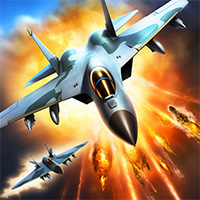
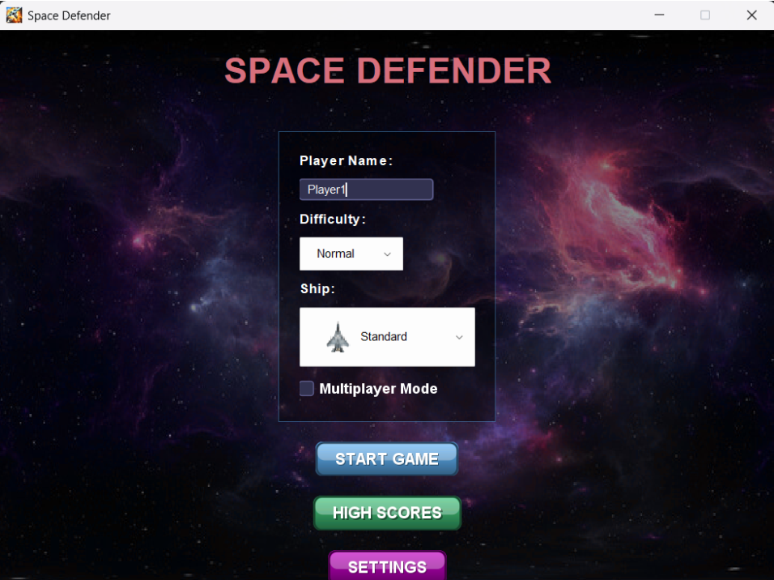

# 🚀 Space Defender Game – Projet Java 

## 🎮 Description du Jeu

**Space Defender** est un jeu de tir spatial en Java où le joueur contrôle un vaisseau pour éliminer des drones ennemis. Le jeu comporte plusieurs niveaux, avec une difficulté croissante. Une version évoluée permet un **mode multijoueur en réseau**.

🧠 Ce projet permet de mettre en œuvre les notions de :
- Programmation événementielle (Swing / JavaFX)
- Threads pour l’animation
- Communication réseau (Sockets Java)

---

## 🧩 Fonctionnalités

### ✅ Version Mono-joueur
- 🕹️ Contrôle du vaisseau via le clavier
- 🎯 Tir de projectiles pour éliminer les ennemis
- 💥 Animation d'explosion lors des collisions
- 🧱 Gestion des niveaux et progression
- 🧾 Affichage du score, du nom du joueur, du niveau et des vies restantes (interface graphique)
- 💾 Sauvegarde des parties et scores dans une base de données

### 🌐 Version Multijoueur (2e version)
- 🔗 Connexion client-serveur via **Java Sockets**
- 🆚 Mode duel compétitif entre joueurs
- 🔄 Synchronisation des actions en temps réel
- 💬 Système de chat intégré
- 👥 Affichage de l’état de chaque joueur

---

## 🖥️ Interface Utilisateur

- 🛫 Écran de démarrage : choix du nom du joueur, avion et niveau
- 🧾 InfoBoard (score, joueur, niveau)
- ❤️ Vies restantes affichées sous forme d’icônes
- 💥 Animations visuelles (explosions, tirs)

---

## 🧪 Technologies et Concepts

| Technologie / Concept | Utilisé |
|-----------------------|---------|
| Java (JDK 8+)         | ✅ |
| Swing / JavaFX        | ✅ |
| Programmation événementielle | ✅ |
| Threads (Runnable)    | ✅ |
| JDBC (Base de données pour les scores) | ✅ |
| Java Sockets (TCP)    | ✅ (mode réseau) |

---

## 📸 Aperçu du jeu

  
  
  

---

